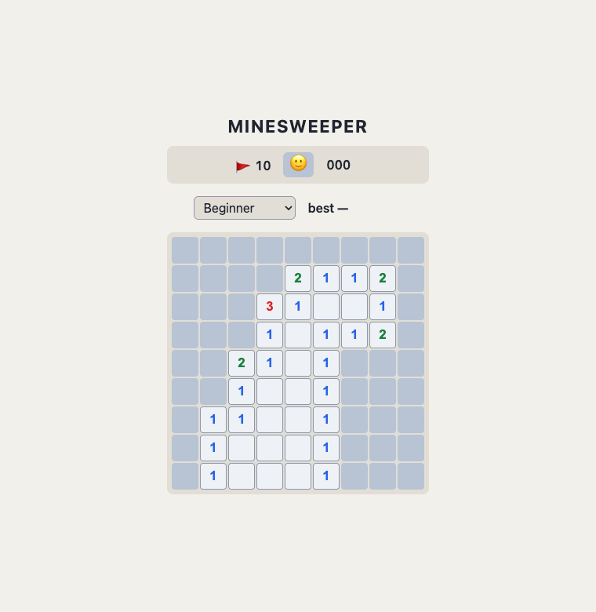

# Minesweeper

Classic Minesweeper in the browser — a pure-TypeScript engine driving a vanilla DOM UI. Built end-to-end by an AI dev pipeline as its pilot project (spec in [SPEC.md](SPEC.md)).

**Play it:** https://mitchellsam.github.io/minesweeper/



## How to play

- **Left-click / tap** — reveal a cell (your first reveal is never a mine)
- **Right-click / long-press** — flag a suspected mine
- **Click a satisfied number** — chord: reveals its remaining neighbors
- **R** or the face button — new game
- Difficulty presets: beginner (9×9, 10), intermediate (16×16, 40), expert (30×16, 99)
- Timer starts on your first reveal; best times per difficulty are kept in your browser

## Development

```bash
npm ci
npm run dev        # local dev server
npm test           # Vitest (engine + controller + persistence)
npm run lint       # eslint
npm run typecheck  # tsc --noEmit
npm run build      # production build (dist/)
```

The engine (`src/engine.ts`) is pure and immutable — board state in, board state out — with seedable RNG for deterministic tests. The UI (`src/main.ts`) is a thin DOM layer over a testable `Game` controller.

## Pipeline

PRs into `main` require green CI and get an automated Claude review; merges auto-deploy to GitHub Pages. See the workflows in `.github/workflows/`.
